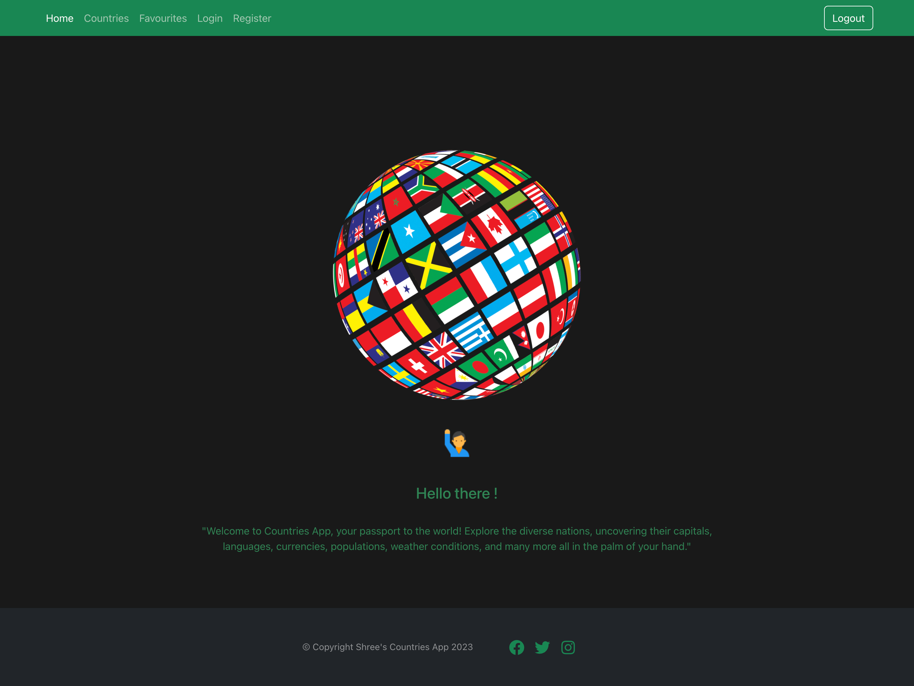
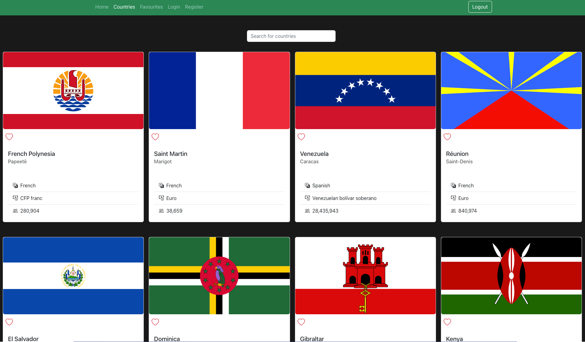
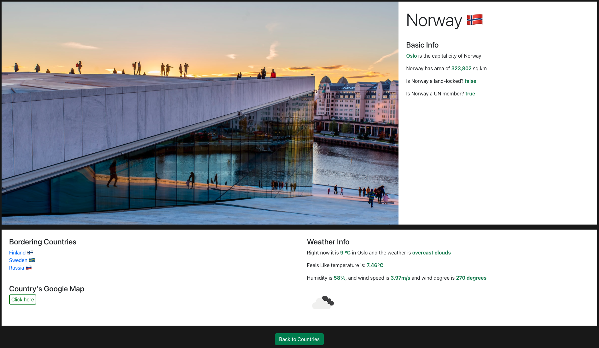
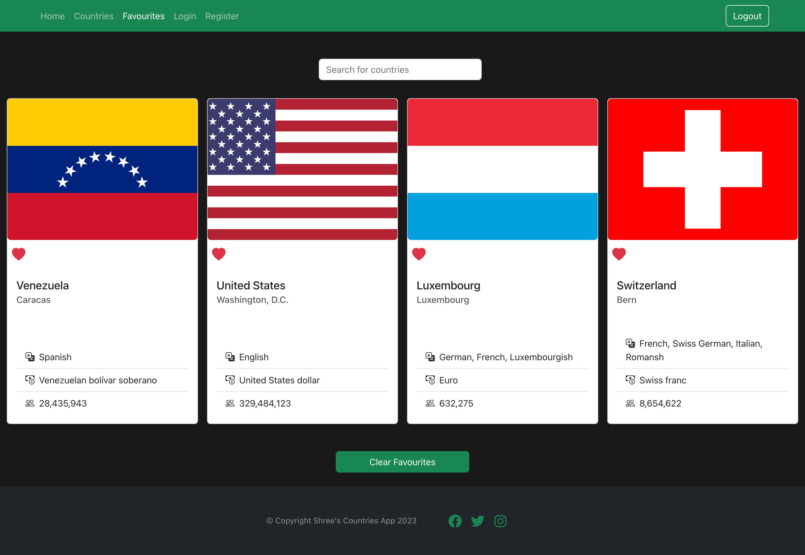
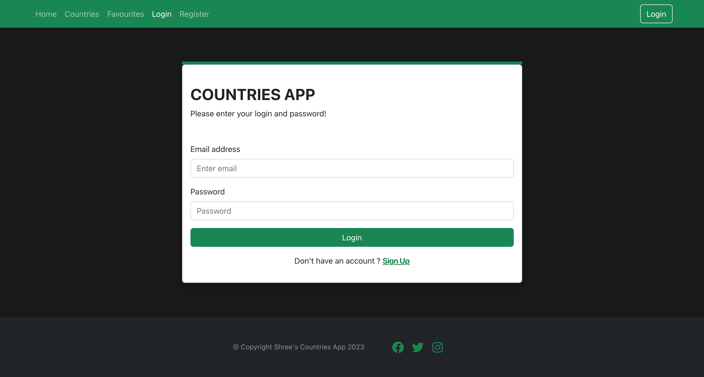

# COUNTRIES APP   

This is a final project of the course 'React Advanced'. It is an app where the users can explore the information about the countries in the world. Using this app, users can learn about the capital city, language, currency, population, weather etc of various countries.The page Layout contains navbar with nav links, outlet with main info, and footer with copyright text and social media icons. Homepage contains welcome message with earth rotating animation, Countries page contains the list of countries with their capital, language, currency, and population displayed in a card. When the card is clicked, it directs to another page where more information of that specific country such as basic info, bordering countries, weather info etc can be seen. This app also contains authentication, therefore to know about countries, user must register to the app and need to login. On top of that, the users can add their favourite countries to the favourites page with a click on heart icon.

## Screenshots

## Technologies used

Built with:
- React
- Firebase
- Bootstrap
- CSS

## To run this app
- `git clone` https://github.com/shree0007/Countries-App_react
- `npm install` to install all dependencies
- `npm start` to run the app (http://localhost:3000/)
- `Note!` Need to have own weather api key and firebase configuration keys

## Important Features used
- React Router Dom
- React Redux and React Redux Toolkit
- Authentication
- React styled components animation
- Axios
- Event handlers

## Sources
- Countries and their information from [Countries API](https://restcountries.com/)
- Weather information [OpenWeather API](https://openweathermap.org/api)
- Random picture of Country's capital from [Unsplash](https://unsplash.com/)

## Acknowledgement
- Thank you [Martin Holland](https://github.com/martin-holland) for the guidance throughout the project 

